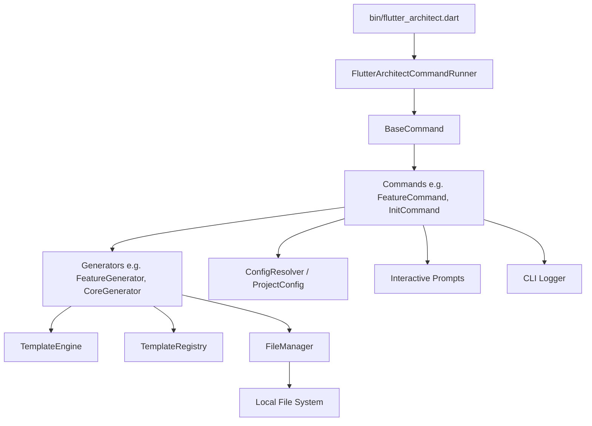

# Flutter Architect Internal Architecture

This document describes the internal design and software architecture of the `flutter_architect` CLI itself.

---

## 🏗️ High-Level Design

---

## 🧩 Core Subsystems

### 1. `src/cli/` (Command Runner & Interface)
- `command_runner.dart`: Extends Dart's `args.CommandRunner<int>`. Parses top-level options (`--version`, `--no-color`) and registers all CLI commands.
- `base_command.dart`: Abstract base command providing unified access to `fileManager`, `logger`, `prompts`, `projectConfig`, and common flags (`--dry-run`, `--force`, `--skip-existing`).
- `logger.dart`: ANSI color-aware terminal logger supporting icons, step headers, and `--no-color` mode.
- `prompts.dart`: Interactive terminal prompt helper supporting multi-choice menus, yes/no confirmation, text inputs, and automated fallbacks when running non-interactively or in CI.
- `exit_codes.dart`: Standard POSIX sysexit codes (0 = Success, 64 = Usage, 65 = Data Error, etc.).

### 2. `src/configuration/` (Project Configuration)
- `project_config.dart`: Type-safe configuration model representing `flutter_architect.yaml` settings.
- `config_resolver.dart`: Manages loading, saving, and merging configuration with CLI flags at runtime.

### 3. `src/filesystem/` (Safe File Management)
- `file_manager.dart`: Encapsulates all file I/O operations. Enforces collision handling (skip, prompt, overwrite) and supports non-destructive `--dry-run` operations.
- `generation_result.dart`: Tracks the status of each generated file (`created`, `overwritten`, `skipped`, `dryRun`).

### 4. `src/naming/` (Naming Utilities)
- `naming_utils.dart`: Pure utility converting user input across multiple cases:
  - `toSnakeCase()` (file and folder names)
  - `toPascalCase()` (classes, types, widgets)
  - `toCamelCase()` (variables, properties, methods)
  - `toTitleCase()` (UI labels, human-readable strings)
  - `toKebabCase()` (slugs, URLs)
  - `toConstantCase()` (constant keys)

### 5. `src/templates/` (Template Engine)
- `template_engine.dart`: Lightweight, zero-dependency mustache-style renderer. Supports:
  - Variable interpolation: `{{variable_name}}`
  - Conditionals: `{{#has_flag}}...{{/has_flag}}`
  - Inverted conditionals: `{{^has_flag}}...{{/has_flag}}`
  - Local template overrides via `.flutter_architect/templates/`.
- `template_registry.dart`: Embedded, compiled-in template repository ensuring that global `dart pub global activate` installations work out-of-the-box without missing relative template assets.

### 6. `src/generators/` (Code Scaffolding)
- `base_generator.dart`: Abstract base class orchestrating template resolution, package name discovery, and file writing.
- Specialized generators:
  - `core_generator.dart`
  - `feature_generator.dart`
  - `bloc_generator.dart` / `cubit_generator.dart`
  - `model_generator.dart` / `repository_generator.dart` / `datasource_generator.dart` / `usecase_generator.dart`
  - `page_generator.dart` / `widget_generator.dart` / `dialog_generator.dart` / `bottomsheet_generator.dart`
  - `api_generator.dart`
  - `theme_generator.dart`
  - `localization_generator.dart`
  - `flavors_generator.dart`
  - `firebase_generator.dart`

### 7. `src/validation/` (Architectural Rule Enforcement)
- `architecture_validator.dart`: Inspects feature folders, ensures `entities/` is not present, verifies layer naming, and flags illegal dependencies (e.g. Domain importing Presentation or Flutter UI widgets).

### 8. `src/doctor/` (System Diagnostics)
- `doctor_runner.dart`: Inspects Dart SDK, Flutter toolchain, project configuration, and dependencies (`flutter_bloc`, `dio`, `get_it`).

---

## 🔒 Security & Reliability Principles

1. **No Silent Overwrites**: Files are never replaced without user consent or explicit `--force` flags.
2. **Framework Decoupling**: Domain layer is kept pure Dart without Flutter UI dependencies.
3. **No Dynamic Traps**: Generated code avoids untyped `dynamic` where concrete models can be expressed.
4. **Environment Isolation**: `.env` files are generated with warnings never to commit production secrets.
