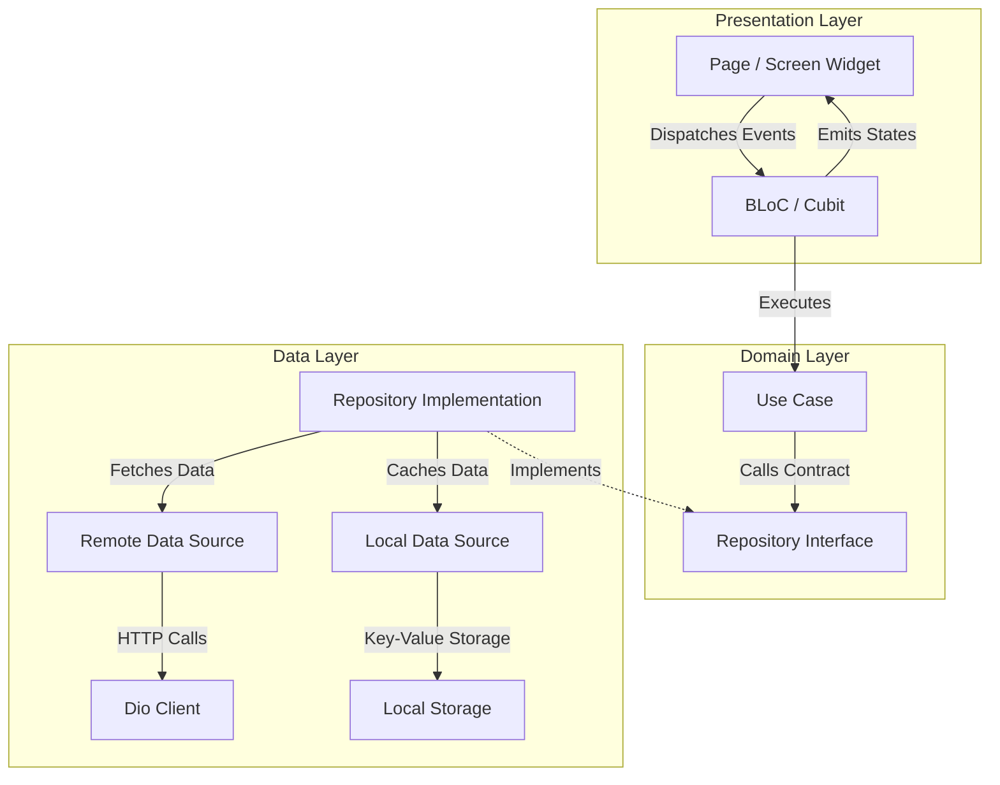

# Flutter Architect 🏗️

> A production-ready Flutter CLI for generating and maintaining Clean Architecture, BLoC, API layers, and enterprise project scaffolding.

[](https://pub.dev/packages/flutter_architect)
[](https://dart.dev)
[](https://flutter.dev)
[](https://opensource.org/licenses/MIT)
[](#-testing)
[](https://dart.dev/guides/language/effective-dart)

---

## 📖 Introduction

**Flutter Architect** is a developer CLI inspired by Angular CLI, Rails generators, and Mason scaffolding. It automates the generation and maintenance of scalable **Clean Architecture + BLoC + Feature-first** Flutter projects.

Instead of writing repetitive boilerplate or relying on unstructured folder copiers, Flutter Architect generates **real, strongly typed, compilable Dart code** with modern error handling (`Result<T>`, typed failures), Dio networking with interceptors, GetIt dependency injection, Material 3 theming, build flavors, and CI/CD validation.

> 💡 **Design Philosophy**: By default, Flutter Architect **does not generate an `entities/` folder**, eliminating redundant model-to-entity mapping boilerplate in 95% of real-world apps while preserving strict architectural boundaries between Domain, Data, and Presentation.

---

## 💡 Why Flutter Architect?

| Problem in Flutter Teams | Solution with Flutter Architect |
| :--- | :--- |
| **Architectural Drift** | Enforces a strict, consistent Clean Architecture structure across all features. |
| **Boilerplate Fatigue** | Generates working BLoCs, Models, Repositories, UseCases, and DataSources in 1 command. |
| **Broken Layer Boundaries** | Built-in `flutter-architect validate` prevents Domain from importing Presentation or UI. |
| **Silent Overwrites** | Safe collision resolver with interactive prompts, `--force`, `--skip-existing`, and `--dry-run`. |
| **Relative Import Hell** | Automatically reads `pubspec.yaml` to generate clean `package:my_app/...` imports. |
| **CI/CD Quality Control** | Run `flutter-architect validate` in GitHub Actions to stop malformed PRs. |

---

## 🏛️ Architecture Overview

Flutter Architect scaffolds a modular **Clean Architecture** with a **Feature-first** organization:



### The 4 Core Layers

1. **Presentation (`lib/features/<name>/presentation/`)**:
   Contains Pages, Widgets, Dialogs, BottomSheets, and BLoC/Cubit state management. Strictly UI and state handling; never communicates with DataSources directly.
2. **Domain (`lib/features/<name>/domain/`)**:
   The business core of the application. Contains UseCases and Repository interfaces. Pure Dart, free from Flutter UI framework dependencies.
3. **Data (`lib/features/<name>/data/`)**:
   Implements domain repository contracts. Coordinates between Remote DataSources (REST API/Dio) and Local DataSources (Cache). Defines serialization Models.
4. **Core (`lib/core/`)**:
   Shared infrastructure across all features: Network clients, Error/Failure classes, Design tokens, Routing, and Extensions.

---

## 📦 Installation

Activate `flutter_architect` globally using the Dart SDK:

```bash
dart pub global activate flutter_architect
```

Make sure your system PATH contains the pub cache bin directory:
* **macOS / Linux**: `~/.pub-cache/bin`
* **Windows**: `%LOCALAPPDATA%\Pub\Cache\bin`

Verify installation:

```bash
flutter-architect --version
```

---

## 🚀 Quick Start

### 1. In a New Flutter Project

```bash
# 1. Create a Flutter project
flutter create my_shop
cd my_shop

# 2. Initialize Clean Architecture scaffolding
flutter-architect init

# 3. Add core dependencies
flutter pub add flutter_bloc dio get_it

# 4. Generate your first feature
flutter-architect feature catalog
```

### 2. In an Existing Flutter Project

Flutter Architect is 100% safe to run inside existing Flutter projects. It never overwrites your existing files without confirmation:

```bash
cd existing_project
flutter-architect init --skip-existing
flutter-architect feature user_profile
flutter-architect doctor
```

---

## 💻 Interactive Setup (`init`)

Running `flutter-architect init` launches an interactive wizard:

```text
Flutter Architect

? Project architecture:
  > 1) Clean Architecture
    2) Feature-first

? State management:
  > 1) BLoC
    2) Cubit
    3) None

? Networking:
  > 1) Dio
    2) None

? Dependency injection:
  > 1) GetIt
    2) None

? Theme:
  > 1) Material 3 + Light/Dark
    2) Standard

? Generate example feature (auth)? (Y/n): Y

Creating Flutter architecture...
✓ Created lib/core/error/failures.dart
✓ Created lib/core/error/exceptions.dart
✓ Created lib/core/utils/result.dart
✓ Created lib/core/constants/app_constants.dart
✓ Created lib/core/extensions/context_extensions.dart
✓ Created lib/core/network/dio_client.dart
✓ Created lib/core/theme/app_theme.dart
✓ Created lib/injection/injection_container.dart
✓ Created lib/features/auth/...

Flutter Architect project initialized successfully.
```

### Non-Interactive / Automation Mode (CI/CD)

All interactive prompts can be bypassed using command-line arguments:

```bash
flutter-architect init \
  --architecture clean \
  --state-management bloc \
  --network dio \
  --di get_it \
  --theme material3 \
  --example-feature \
  --force
```

---

## 🗂️ Complete Generated Folder Tree

```text
lib/
├── core/
│   ├── constants/
│   │   └── app_constants.dart             # Storage keys, timeouts, app metadata
│   ├── error/
│   │   ├── exceptions.dart                # ServerException, CacheException, NetworkException
│   │   └── failures.dart                  # ServerFailure, CacheFailure, ValidationFailure
│   ├── extensions/
│   │   └── context_extensions.dart        # BuildContext shortcuts: theme, colorScheme, textTheme
│   ├── network/
│   │   ├── api_endpoints.dart             # Centralized API URLs and paths
│   │   ├── dio_client.dart                # Configured Dio instance with timeouts & headers
│   │   ├── network_info.dart              # Connectivity checker abstraction
│   │   └── interceptors/
│   │       ├── error_interceptor.dart     # Auto-maps Dio errors to typed ServerExceptions
│   │       └── logging_interceptor.dart   # Pretty curl/request/response logs in debug mode
│   ├── routing/
│   │   └── app_router.dart                # Declarative route generator
│   ├── theme/
│   │   ├── app_colors.dart                # Material 3 color palettes
│   │   ├── app_text_styles.dart           # Typography scale
│   │   ├── app_theme_mode.dart            # Light, Dark, System enum
│   │   └── app_theme.dart                 # lightTheme and darkTheme ThemeData definitions
│   ├── utils/
│   │   └── result.dart                    # Modern Dart 3 functional Result<T> (Success/Failure)
│   └── widgets/
│       ├── error_view.dart                # Generic error display with retry callback
│       └── loading_indicator.dart         # Styled progress indicator
│
├── features/
│   └── auth/                              # Feature-first module
│       ├── data/
│       │   ├── datasources/
│       │   │   ├── auth_remote_datasource.dart # Dio API calls
│       │   │   └── auth_local_datasource.dart  # Local cache/storage
│       │   ├── models/
│       │   │   └── auth_model.dart             # fromJson, toJson, copyWith
│       │   └── repositories/
│       │       └── auth_repository_impl.dart   # Implements domain repository contract
│       ├── domain/
│       │   ├── repositories/
│       │   │   └── auth_repository.dart        # Pure domain interface
│       │   └── usecases/
│       │       └── get_auth_usecase.dart       # Single-responsibility usecase
│       └── presentation/
│           ├── bloc/
│           │   ├── auth_bloc.dart              # Modern Bloc with event handlers
│           │   ├── auth_event.dart             # Sealed events
│           │   └── auth_state.dart             # Initial, Loading, Loaded, Error states
│           ├── pages/
│           │   └── auth_page.dart              # BlocConsumer page with loading & error states
│           └── widgets/
│               └── auth_item_view.dart         # Reusable card widget
│
├── injection/
│   └── injection_container.dart           # GetIt service locator setup
│
├── .env                                   # Local environment variables
├── .env.example                           # Template environment configuration
├── flutter_architect.yaml                 # Project architecture configuration
└── main.dart                              # Application entrypoint
```

---

## 🛠️ Complete Command Reference

### Project Lifecycle Commands

#### `flutter-architect init`
Scaffolds Clean Architecture in the current directory.
```bash
flutter-architect init [options]
# Options:
#   -a, --architecture       [clean | feature_first] (default: clean)
#   -s, --state-management   [bloc | cubit | none]   (default: bloc)
#   -n, --network            [dio | none]            (default: dio)
#   -d, --di                 [get_it | none]         (default: get_it)
#   -t, --theme              [material3 | standard]  (default: material3)
#       --example-feature    Generate example auth feature (default: true)
#   -f, --force              Overwrite files without prompting
#       --dry-run            Preview generated files without touching disk
```

#### `flutter-architect configure`
Inspect or update settings in `flutter_architect.yaml`.
```bash
# View configuration
flutter-architect configure --show

# Update state management to Cubit
flutter-architect configure --state-management cubit
```

#### `flutter-architect doctor`
Runs comprehensive environment and project diagnostics.
```bash
flutter-architect doctor
```
Checks:
* Dart SDK & version
* Flutter SDK & version
* `pubspec.yaml` detection
* `flutter_architect.yaml` configuration validity
* Presence of `flutter_bloc`, `dio`, and `get_it` dependencies

#### `flutter-architect validate`
Validates architecture layer boundaries and naming conventions. Exits with code `0` on success or `65` on error. Ideal for CI/CD pipelines!
```bash
flutter-architect validate
```

#### `flutter-architect version`
Prints current CLI version.
```bash
flutter-architect version
```

---

### Architecture & Feature Commands

#### `flutter-architect feature <name>`
Scaffolds a complete Clean Architecture feature bundle (Data, Domain, Presentation).
```bash
flutter-architect feature product_detail

# Preview before writing:
flutter-architect feature product_detail --dry-run
```
Generates:
* `data/models/product_detail_model.dart`
* `data/datasources/product_detail_remote_datasource.dart`
* `data/datasources/product_detail_local_datasource.dart`
* `domain/repositories/product_detail_repository.dart`
* `data/repositories/product_detail_repository_impl.dart`
* `domain/usecases/get_product_detail_usecase.dart`
* `presentation/bloc/product_detail_bloc.dart`
* `presentation/bloc/product_detail_event.dart`
* `presentation/bloc/product_detail_state.dart`
* `presentation/pages/product_detail_page.dart`
* `presentation/widgets/product_detail_item_view.dart`

#### `flutter-architect module <name>`
Generates an isolated modular architecture package.
```bash
flutter-architect module analytics
```

---

### State Management Commands

#### `flutter-architect bloc <name>`
Generates modern `flutter_bloc` 8.x/9.x classes with Initial, Loading, Loaded, and Error states.
```bash
flutter-architect bloc cart --feature shopping
```

#### `flutter-architect cubit <name>`
Generates a Cubit and associated State class.
```bash
flutter-architect cubit settings --feature profile
```

---

### Data & Domain Commands

#### `flutter-architect model <name>`
Generates a strongly typed data model with `fromJson`, `toJson`, `copyWith`, and value equality.
```bash
flutter-architect model user --feature auth
```

#### `flutter-architect repository <name>`
Generates domain repository interface and data implementation.
```bash
flutter-architect repository payment --feature checkout
```

#### `flutter-architect datasource <name>`
Generates remote and local data source implementations.
```bash
flutter-architect datasource order --feature checkout
```

#### `flutter-architect usecase <name>`
Generates a single-responsibility callable domain usecase.
```bash
flutter-architect usecase calculate_discount --feature checkout
```

---

### UI Component Commands

#### `flutter-architect page <name>`
Generates a theme-aware Material 3 responsive Scaffold page.
```bash
flutter-architect page dashboard
```

#### `flutter-architect widget <name>`
Generates a reusable, theme-aware widget.
```bash
flutter-architect widget user_avatar
```

#### `flutter-architect dialog <name>`
Generates a static `show()` dialog helper with confirm/cancel buttons.
```bash
flutter-architect dialog delete_confirmation
```

#### `flutter-architect bottomsheet <name>`
Generates a responsive modal bottom sheet with drag handles and keyboard insets handling.
```bash
flutter-architect bottomsheet sort_filter
```

---

### API Commands

#### `flutter-architect api <name>`
Generates an end-to-end API integration slice with DataSource, ResponseModel, Repository, UseCase, and BLoC:
```bash
flutter-architect api login --method post
flutter-architect api fetch_user --method get
flutter-architect api update_profile --method put
flutter-architect api delete_account --method delete
```

#### `flutter-architect endpoint <name>`
Registers a new endpoint constant in `lib/core/network/api_endpoints.dart`:
```bash
flutter-architect endpoint orders --path /v1/user/orders
```

---

### Utility & Configuration Commands

#### `flutter-architect theme`
Scaffolds or updates Material 3 design tokens, typography, and light/dark theme modes:
```bash
flutter-architect theme
```

#### `flutter-architect localization`
Scaffolds Flutter localization (`l10n.yaml`, `lib/l10n/app_en.arb`, `lib/l10n/app_es.arb`):
```bash
flutter-architect localization
```

#### `flutter-architect flavors`
Generates multi-flavor build entrypoints (`lib/main_development.dart`, `lib/main_staging.dart`, `lib/main_production.dart`, `lib/flavors/flavor_config.dart`, and environment files):
```bash
flutter-architect flavors
```

Run a specific flavor:
```bash
flutter run -t lib/main_development.dart --flavor development
flutter run -t lib/main_staging.dart --flavor staging
flutter run -t lib/main_production.dart --flavor production
```

#### `flutter-architect firebase`
Generates `lib/core/firebase/firebase_service.dart` wrapper with Crashlytics, Analytics, and Messaging boilerplate:
```bash
flutter-architect firebase
```

---

## ⚙️ Configuration (`flutter_architect.yaml`)

When you run `flutter-architect init`, a `flutter_architect.yaml` file is placed in your project root:

```yaml
# Flutter Architect Project Configuration
flutter_architect:
  architecture: clean
  state_management: bloc
  networking: dio
  dependency_injection: get_it
  local_storage: shared_preferences
  theme: material3
  localization: flutter
  environment: dotenv
  generate_entities: false
  # custom_template_path: ./templates
```

All generator commands inspect this configuration so generated code always matches your project settings.

---

## 🎨 Custom Templates

Flutter Architect supports custom template overrides!

1. Create a `.flutter_architect/templates/` folder in your project root (or set `custom_template_path` in `flutter_architect.yaml`).
2. Add your custom template file (e.g. `feature_model.dart`).
3. Use variables such as `{{feature_name}}`, `{{feature_pascal}}`, `{{package_name}}`.
4. When you run `flutter-architect feature <name>`, your custom template will be used instead of the built-in default!

---

## 🛡️ Safe File Generation & Conflict Resolution

Flutter Architect guarantees that your existing files are never overwritten silently:

* **Interactive Mode**: If a file already exists, the CLI prompts:
  ```text
  File already exists: lib/features/auth/presentation/pages/auth_page.dart
  ? What would you like to do?:
    > 1) Skip
      2) Overwrite
  ```
* **Force Overwrite**: Pass `--force` (`-f`) to overwrite without prompting.
* **Skip Existing**: Pass `--skip-existing` to skip existing files safely.
* **Dry Run**: Pass `--dry-run` to see a preview of all files that would be generated without touching the filesystem.

---

## 🤖 CI/CD Integration

Add `flutter-architect validate` into your GitHub Actions workflow (`.github/workflows/ci.yml`) to enforce Clean Architecture boundaries across all pull requests:

```yaml
name: Flutter CI

on: [push, pull_request]

jobs:
  validate-and-test:
    runs-on: ubuntu-latest
    steps:
      - uses: actions/checkout@v4

      - name: Set up Dart & Flutter
        uses: subosito/flutter-action@v2
        with:
          channel: stable

      - name: Install dependencies
        run: flutter pub get

      - name: Install Flutter Architect
        run: dart pub global activate flutter_architect

      - name: Validate Architecture Boundaries
        run: flutter-architect validate

      - name: Analyze Project
        run: flutter analyze

      - name: Run Tests
        run: flutter test
```

---

## 🧪 Testing

The package includes comprehensive tests verifying naming utilities, configuration resolution, template rendering, file generation, diagnostics, and CLI integration:

```bash
# Run unit & integration tests
dart test

# Run analyzer
dart analyze

# Run formatter
dart format --output=none --set-exit-if-changed .
```

---

## ☕ Support

If Flutter Architect saved you time or helped organize your project, you can buy me a chai:

<a href="https://buymeacoffee.com/kishandobariya" target="_blank" rel="ugc">

</a>
&nbsp;
<a href="https://buymeacoffee.com/kishandobariya" target="_blank" rel="ugc">

</a>

Phones open a UPI app. Desktops show a QR to scan.

---

## 👨‍💻 Developer

### Kishan Dobariya

* **Phone:** +91 90232 56218
* **Email:** [flutterdeveloper2206@gmail.com](mailto:flutterdeveloper2206@gmail.com)
* **LinkedIn:** [kishan-dobariya-99b005217](https://www.linkedin.com/in/kishan-dobariya-99b005217)
* **GitHub:** [Kishandobariya76](https://github.com/Kishandobariya76)

---

## 📄 License

This package is licensed under the MIT License. See [LICENSE](LICENSE) for details.
